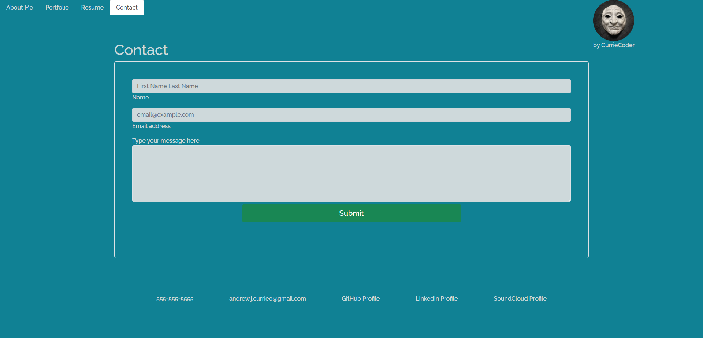

<!-- TODO: MAKE PAGE RERENDER SO NAVIGATION WORKS BETWEEN PAGES -->
<!-- TODO: IS CHESSMATE JUST NOT GOING TO WORK??? -->
<!-- TODO: UPDATE README WITH CURRENT INFO -->

# reactPortfolio1.4
Personal work portfolio

# React Portfolio

Deployed: https://curriecoder.github.io/react-portfolio-rev1/

Repo: https://github.com/curriecoder/react-portfolio-rev1

## Description

This portfolio was creacted using React to display works. I wanted to get used to using React for MVC due to it's popularity in the market. The main motivation for creating this project is to showcase projects I have been a part of to potential collaborators/employers. I learned a metric ton about React and how to build a single page application that feels like a multi-page application using conditional rendering. This portfolio allows me to gain additional visibility in the job market.

<!--  -->

## Credits

I would like to thank the instructor and support staff at the UPenn LPS Coding Bootcamp for their support and prioritization of the students. As always, thank you to the online community of web developers and the vast knowledge base that everyone has made available, to those willing to look.

## License

MIT License

Copyright (c) 2022 Andrew Currie

Permission is hereby granted, free of charge, to any person obtaining a copy
of this software and associated documentation files (the "Software"), to deal
in the Software without restriction, including without limitation the rights
to use, copy, modify, merge, publish, distribute, sublicense, and/or sell
copies of the Software, and to permit persons to whom the Software is
furnished to do so, subject to the following conditions:

The above copyright notice and this permission notice shall be included in all
copies or substantial portions of the Software.

THE SOFTWARE IS PROVIDED "AS IS", WITHOUT WARRANTY OF ANY KIND, EXPRESS OR
IMPLIED, INCLUDING BUT NOT LIMITED TO THE WARRANTIES OF MERCHANTABILITY,
FITNESS FOR A PARTICULAR PURPOSE AND NONINFRINGEMENT. IN NO EVENT SHALL THE
AUTHORS OR COPYRIGHT HOLDERS BE LIABLE FOR ANY CLAIM, DAMAGES OR OTHER
LIABILITY, WHETHER IN AN ACTION OF CONTRACT, TORT OR OTHERWISE, ARISING FROM,
OUT OF OR IN CONNECTION WITH THE SOFTWARE OR THE USE OR OTHER DEALINGS IN THE
SOFTWARE.
